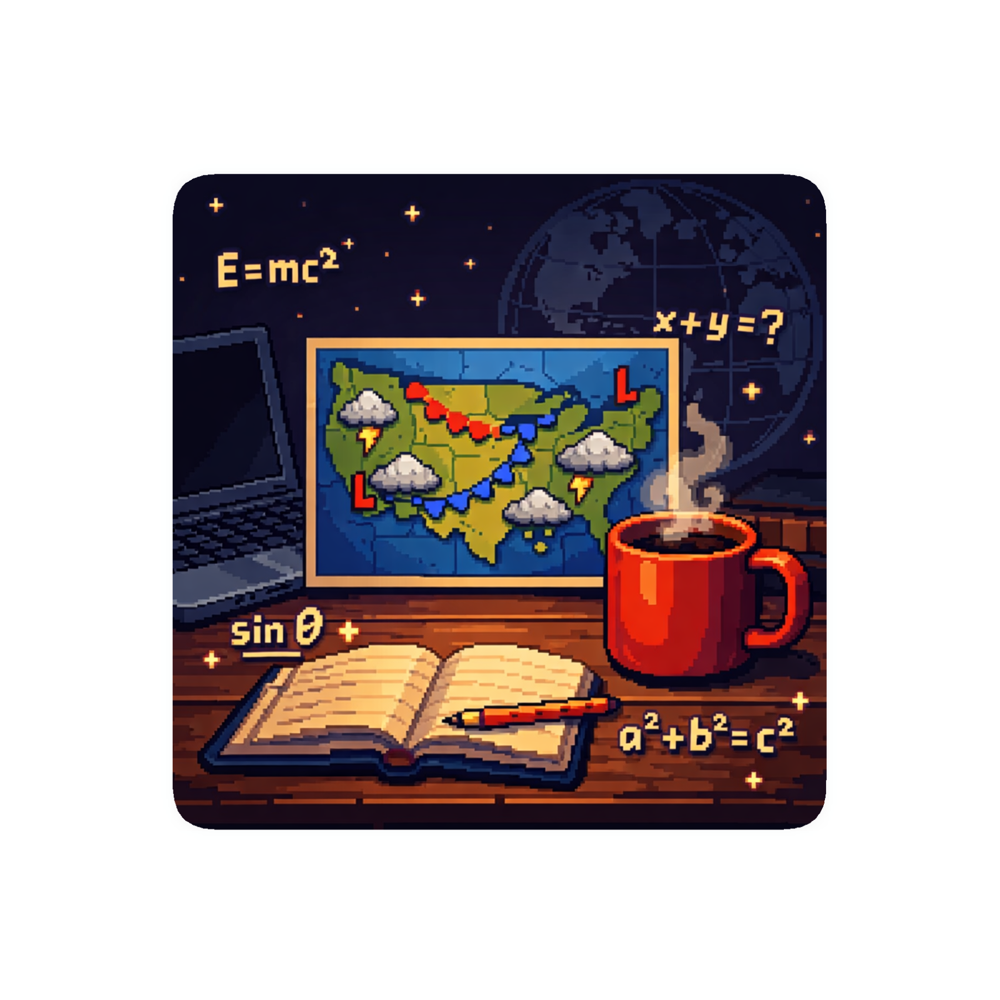

<!-- 1. 顶部 Banner -->
  
  <h1>Welcome to ZhengHang's AOS Lab 🌥️</h1>

  

---

<!-- 2. 技术栈与工具徽章 -->
### 🛠️ Tech Stack & Research Tools

<!-- 第一行：编程语言 -->

  
  
  

<!-- 第二行：排版、工具与前端 -->

  
  
  
  

---

### 📖 关于我 / About Me

🌌 **研究方向**：大气与海洋动力学，气候动力学 (Atmospheric and Oceanic Dynamics & Climate Dynamics)
🌊 **研究兴趣**：专注于研究行星（包括地球）的大气海洋动力学理论
💻 **正在进行**：大气科学与人工智能；前端开发技能，尝试将气象数据处理与 Web 技术结合
🔧 **常用工具**：Panoply, VS Code, LaTeX, Miniconda

### 📬 联系我 / Contact Me

---

  <i>"Exploring the dynamics of the blue marble."</i>

